## Домашнее задание к занятию «Очереди RabbitMQ»

### Задание 1. Установка RabbitMQ

Используя Vagrant или VirtualBox, создайте виртуальную машину и установите RabbitMQ. Добавьте management plug-in и зайдите в веб-интерфейс.

Итогом выполнения домашнего задания будет приложенный скриншот веб-интерфейса RabbitMQ.

#### Ответ: Устанавливал последнюю версию из репозитория.
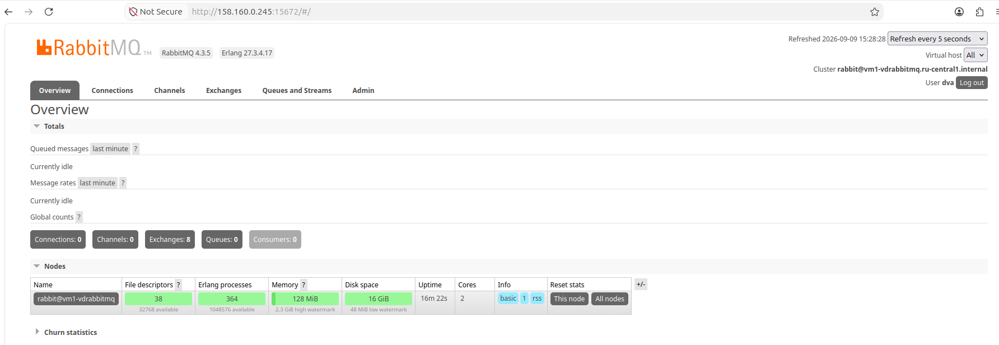

### Задание 2. Отправка и получение сообщений

Используя приложенные скрипты, проведите тестовую отправку и получение сообщения. Для отправки сообщений необходимо запустить скрипт producer.py.

Для работы скриптов вам необходимо установить Python версии 3 и библиотеку Pika. Также в скриптах нужно указать IP-адрес машины, на которой запущен RabbitMQ, заменив localhost на нужный IP.

'pip install pika'

Зайдите в веб-интерфейс, найдите очередь под названием hello и сделайте скриншот. После чего запустите второй скрипт consumer.py и сделайте скриншот результата выполнения скрипта

В качестве решения домашнего задания приложите оба скриншота, сделанных на этапе выполнения.

Для закрепления материала можете попробовать модифицировать скрипты, чтобы поменять название очереди и отправляемое сообщение.

#### Ответ
##### Скрипт для публикации использовал из туториала к rabbitmq для python, очередь назвал hellzero.
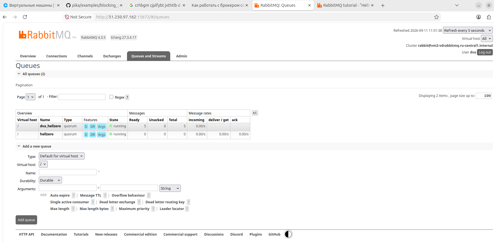

##### Скриншот очереди hellzero. Скрипт для считывания сообщений использовал из туториала к rabbitmq для python.
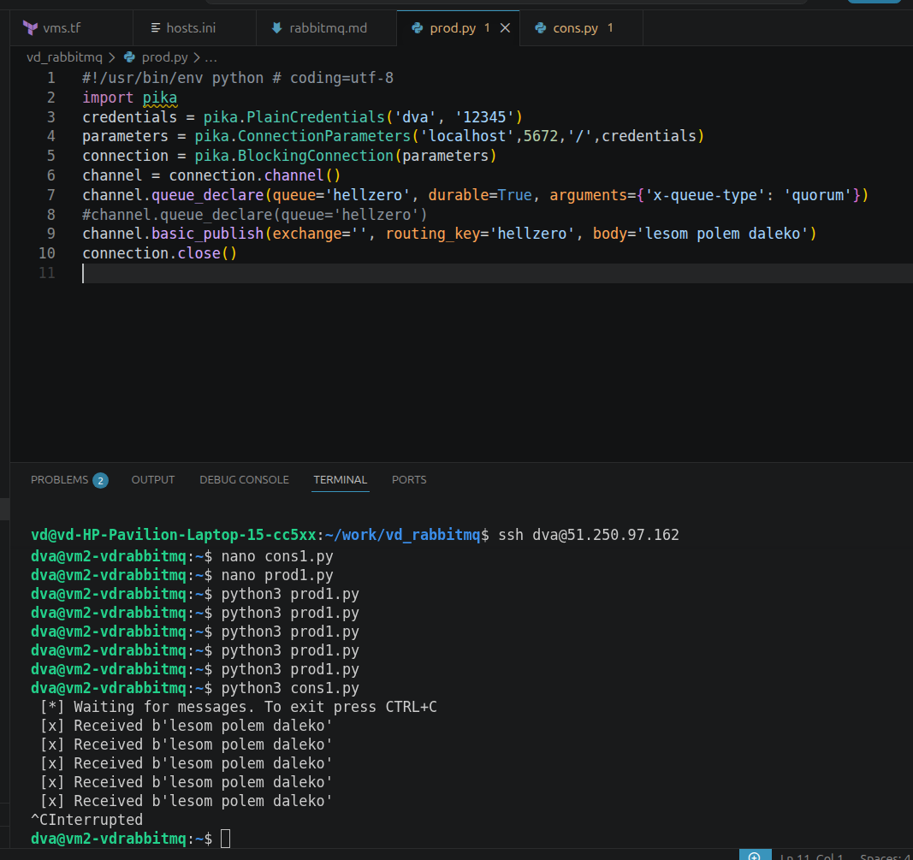

### Задание 3. Подготовка HA кластера

Используя Vagrant или VirtualBox, создайте вторую виртуальную машину и установите RabbitMQ. Добавьте в файл hosts название и IP-адрес каждой машины, чтобы машины могли видеть друг друга по имени.

Пример содержимого hosts файла:

'cat /etc/hosts
192.168.0.10 rmq01
192.168.0.11 rmq02'

После этого ваши машины могут пинговаться по имени.

Затем объедините две машины в кластер и создайте политику ha-all на все очереди.

В качестве решения домашнего задания приложите скриншоты из веб-интерфейса с информацией о доступных нодах в кластере и включённой политикой.

Также приложите вывод команды с двух нод:

$ rabbitmqctl cluster_status

Для закрепления материала снова запустите скрипт producer.py и приложите скриншот выполнения команды на каждой из нод:

$ rabbitmqadmin get queue='hello'

После чего попробуйте отключить одну из нод, желательно ту, к которой подключались из скрипта, затем поправьте параметры подключения в скрипте consumer.py на вторую ноду и запустите его.

Приложите скриншот результата работы второго скрипта.

#### Ответ
##### Виртуалки развернуты в облаке. Ноды добавлены в один кластер. Политика не выполнена, новая версия не поддерживает такую политику, предлагая кворумные очереди.
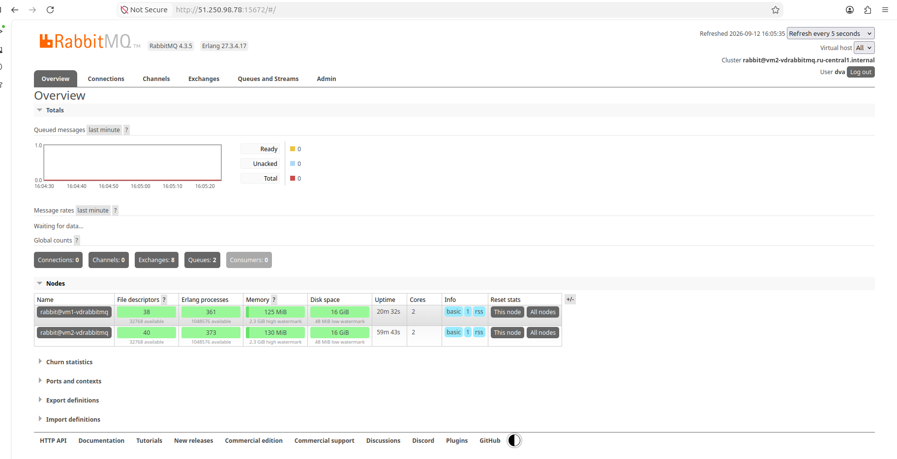

##### cluster_status на вируталках.
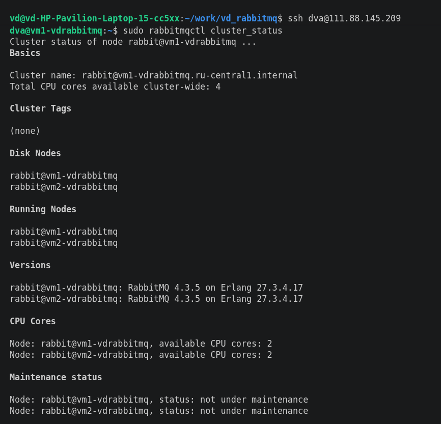
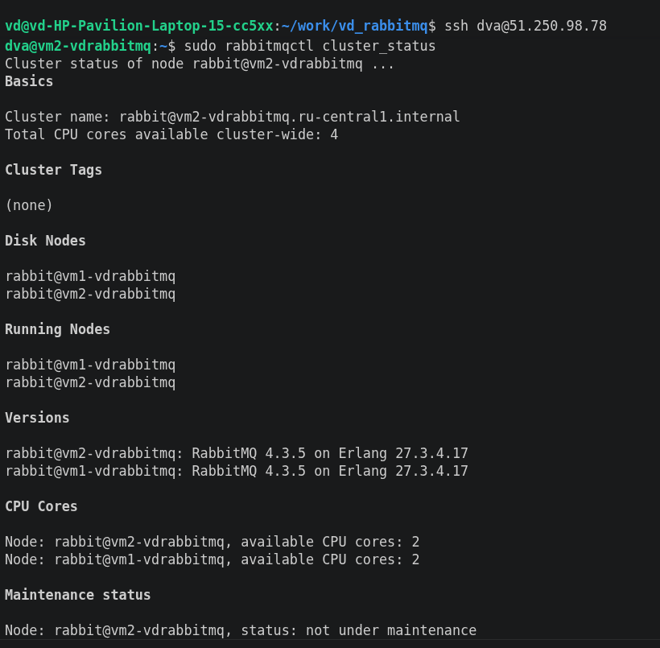

##### Очередь видна на нодах.
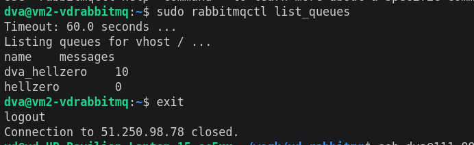
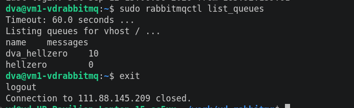

##### Отключаем одну ноду.
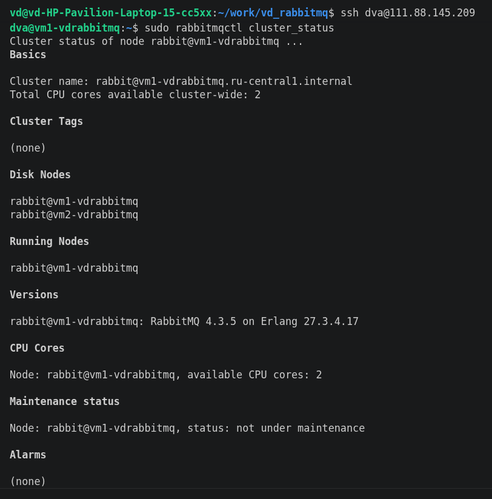
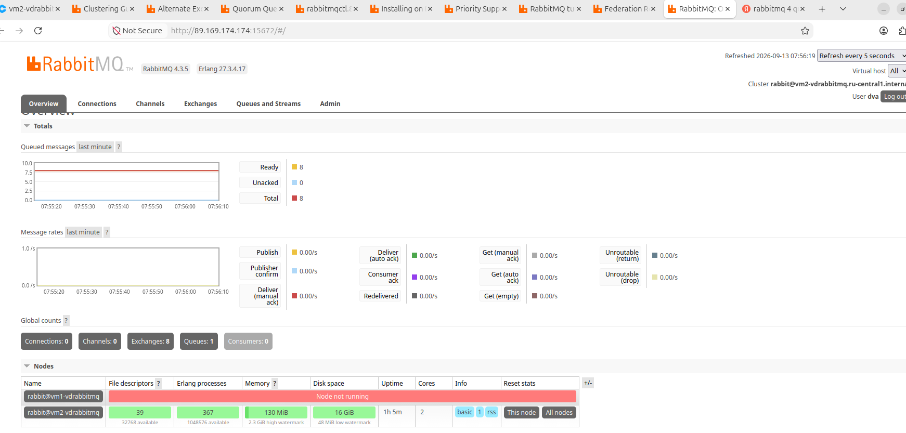

##### Сообщения опубликованные заранее на выключеной ноде не читаются на работающей ноде. причина - стандартный кворум для начала адекватной синхронизации данных - 3 ноды минимум для этой версии rabbitmq
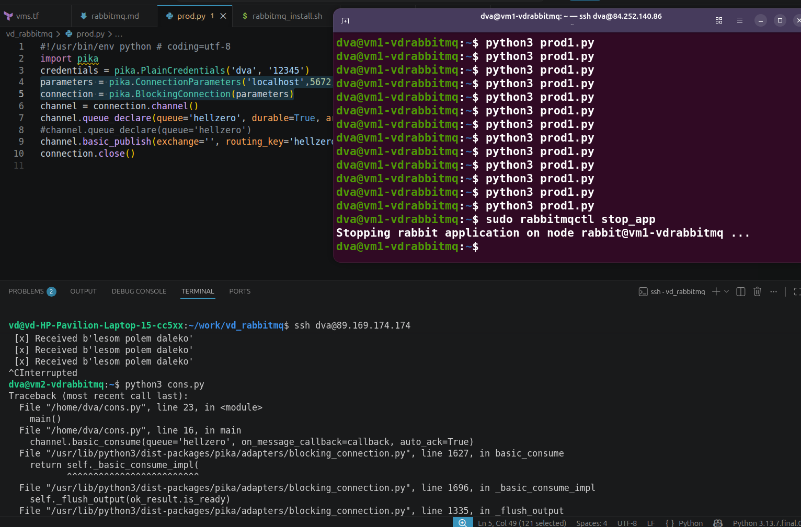

##### Добавляем третью ноду в кластер
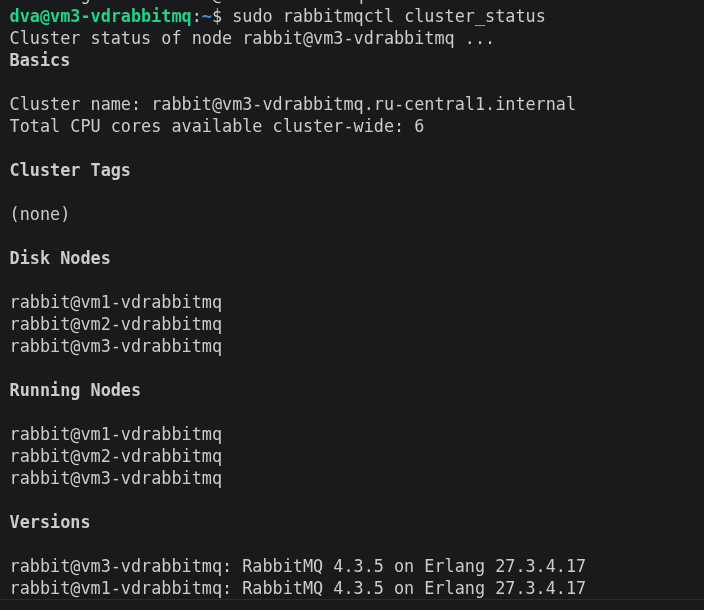

##### Генерим сообщения на ноде, отключаем эту ноду. Читаем сообщения с другой ноды. Все работает, документация не соврала.
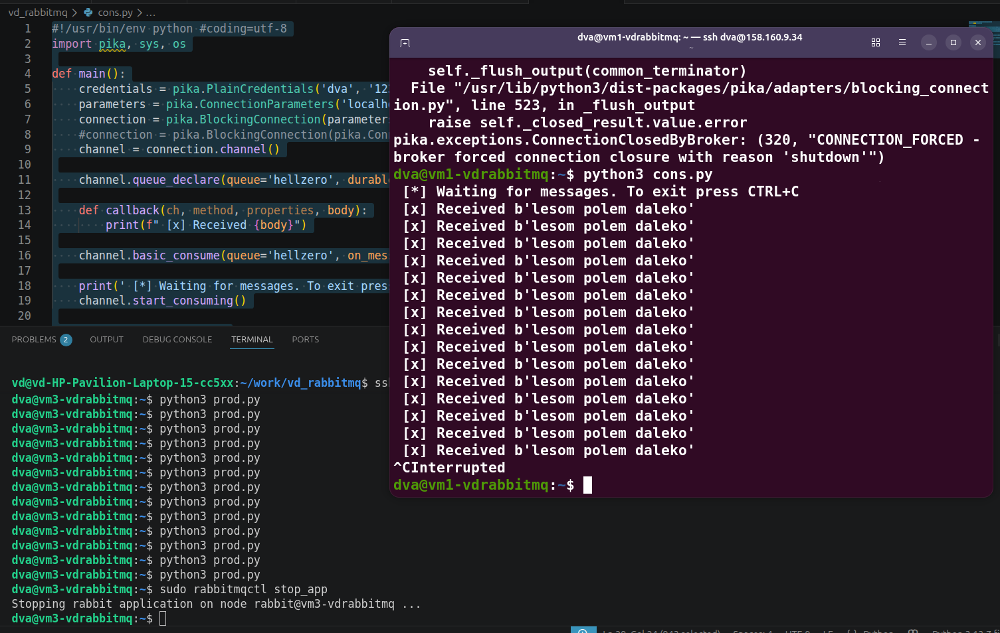

##### Сообщения ушли, нода все еще выключена.
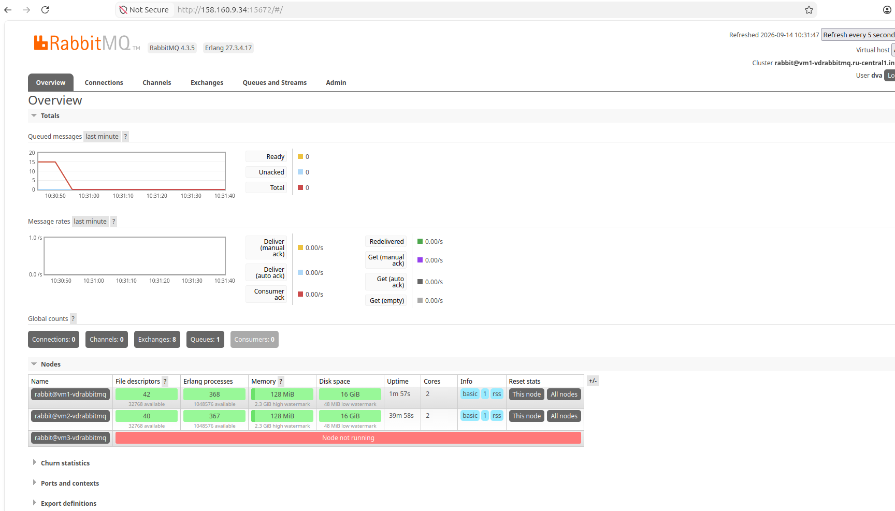
